# AWS S3 bucket Pipeline

## Deliverables

- An S3 bucket was previously created in the console and the required deliverables have been placed within.
- Spin up an S3 in terraform with uploaded pictures/screenshots proving that THEO SAID you passed Armageddon (whether directly or via group leader). 
- A link to the Armageddon repo in a text file or markdown file. 
- A successful webhook invocation of your pipeline. 
- The repo for the pipeline has to be from your own GitHub. 
- The link has to be pasted in the class chat during class so Aaron and Rob can collect. 

## Armageddon Completion Email

## Armageddon Repo Link

- Name: Kelley Moore
- Pipeline Repo: [Brotherhood of Steel Armageddon Repo](https://github.com/Brotherhood-Of-Steel-Cloud-AI-DevOps/BOS-ARMAGEDDON-LABS-1-3)
- S3 Bucket Name: jenkins-321528232261-us-east-2-an
- Status: Webhook verified & S3 proof uploaded.

# Jenkins Pipeline Creation Process

## Webhook Creation

Before a Jenkins pipeline can be created, a GitHub repository with working webhook must be configured.  

To create a working webhook, log into your repository and click Settings:

Next select Webhooks:

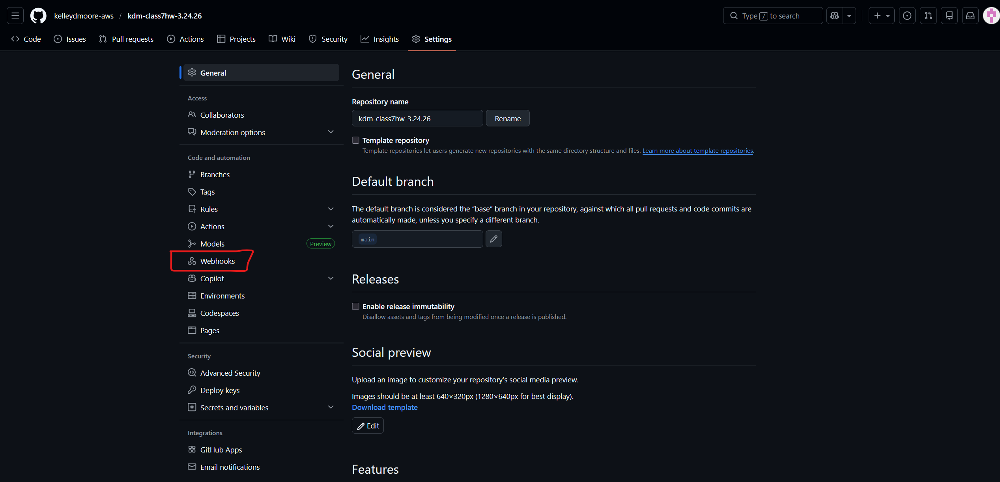

Proceed by clicking Add webhook:

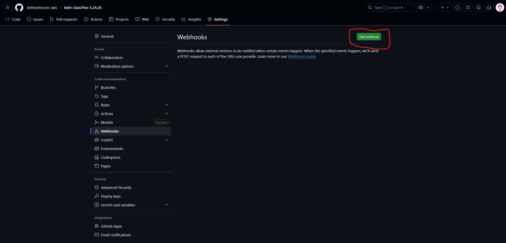

In the next screen, add your Jenkins web URL with "/github-webhook/" appended to it:

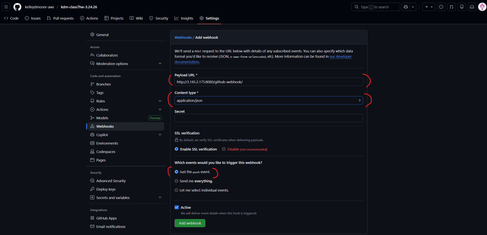

Finally, click Add webhook:

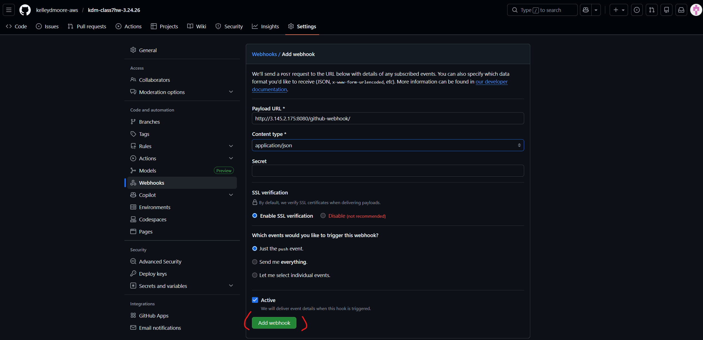

To ensure that the webhook is working, launch a terminal session and run the following commands:

- git commit --allow-empty -m "test webhook"
- git push origin main

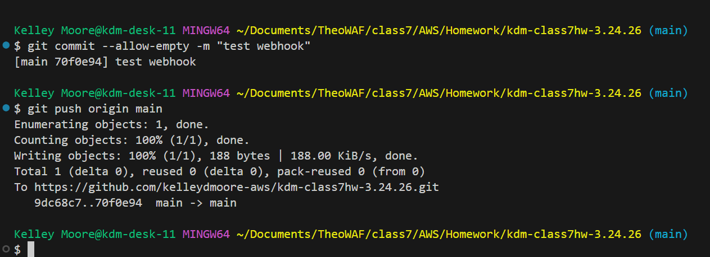

You should receive the following result with a green checkmark as proof of success:

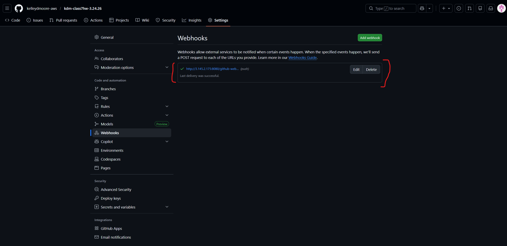

## Jenkins Pipeline Creation

Now that the webhook is done, the pipeline can now be created in Jenkins. 

Log into Jenkins and click New Item:

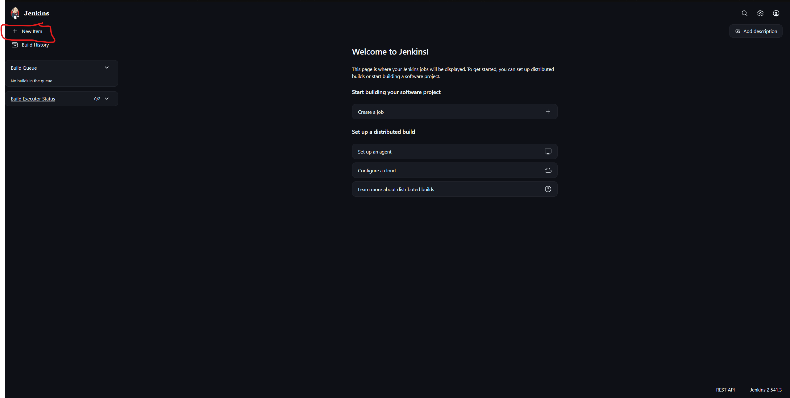

Enter the name of your build and select Pipeline:

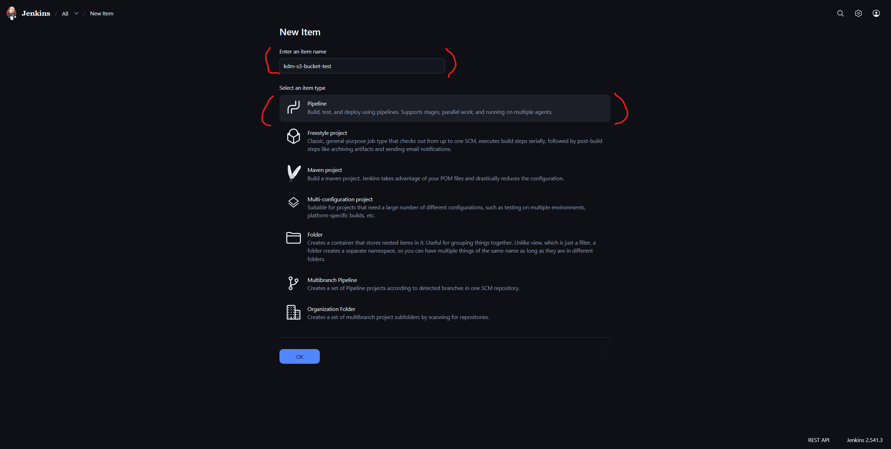

Next, select GitHub hook trigger for GITScm polling:

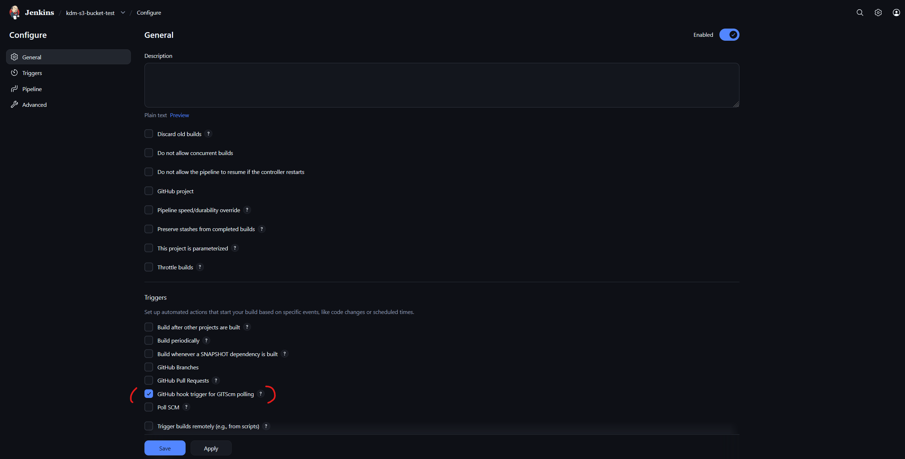

Click Definition and choose Pipeline script from SCM:

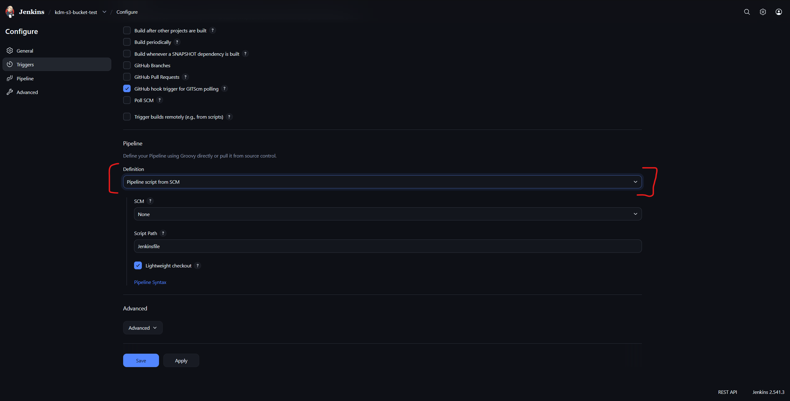

In the SCM dropdown, select Git:

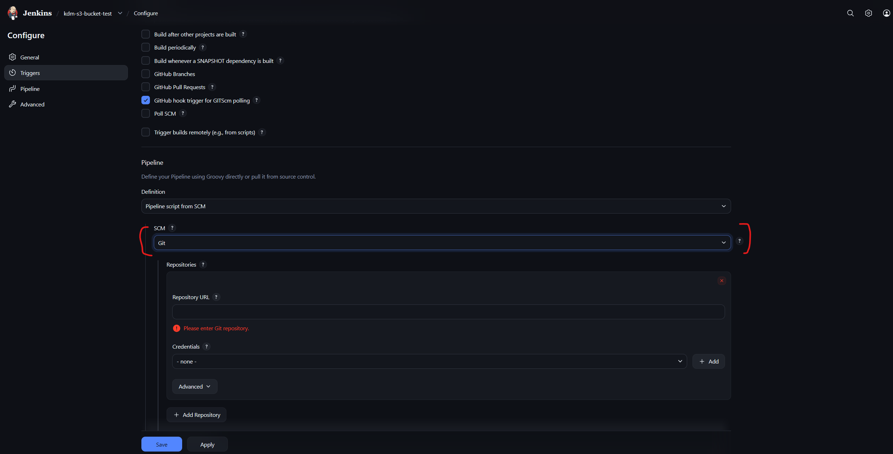

Add your GitHub repository URL in the Repository URL field and "./main" in the Branch Specifier field:

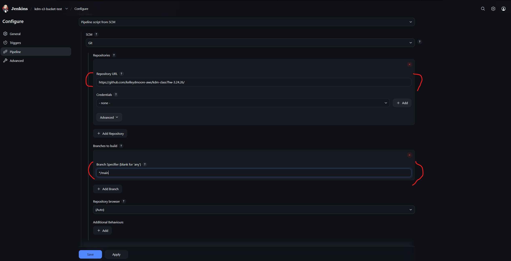

Next, click Save to finish creating the pipeline and then finally Run Build.

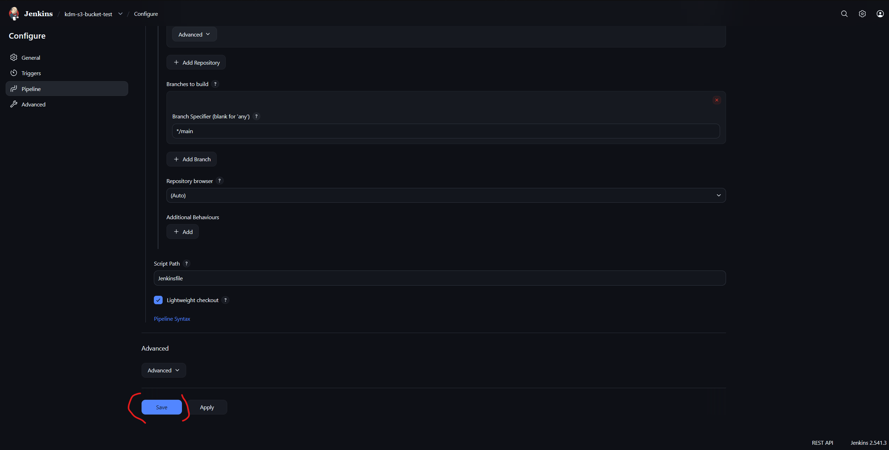

If the build is successful, you should receive the following message within Jenkins: 

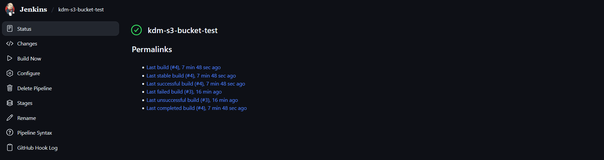

Done.

 

