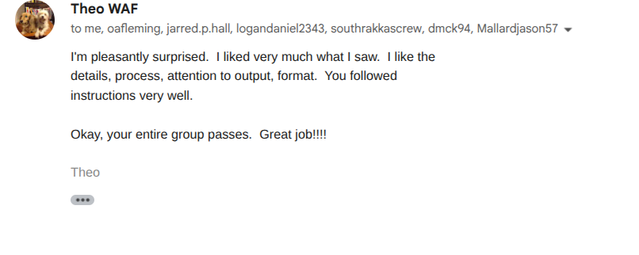
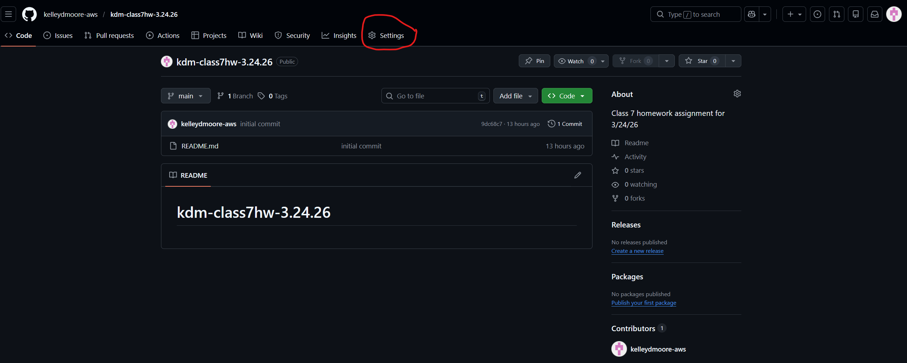

# AWS S3 bucket Pipeline

## Deliverables
- Spin up an S3 in terraform with uploaded pictures/screenshots proving that THEO SAID you passed Armageddon (whether directly or via group leader). 
- A link to the Armageddon repo in a text file or markdown file. 
- A successful webhook invocation of your pipeline. 
- The repo for the pipeline has to be from your own GitHub. 
- The link has to be pasted in the class chat during class so Aaron and Rob can collect. 

## Armageddon Completion Email

## Armageddon Repo Link

- Name: Kelley Moore
- Pipeline Repo: [Brotherhood of Steel Armageddon Repo](https://github.com/Brotherhood-Of-Steel-Cloud-AI-DevOps/BOS-ARMAGEDDON-LABS-1-3)
- S3 Bucket Name: jenkins-321528232261-us-east-2-an
- Status: Webhook verified & S3 proof uploaded.

## Jenkins Pipeline Creation Process

Before a Jenkins pipeline can be created, a GitHub repository with working webhook must be configured.  

To create a working webhook, log into your repository and click Settings:

 

